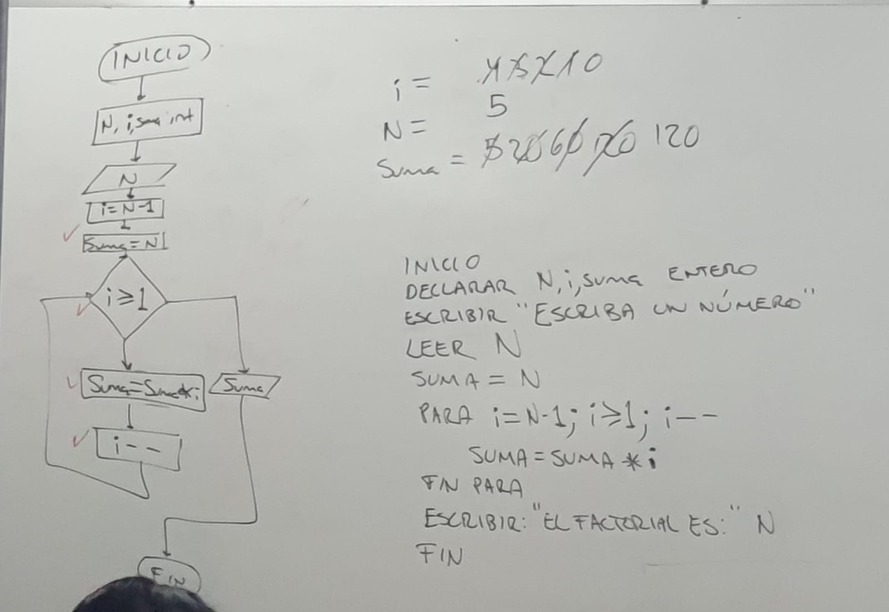

# #6 FACTORIAL Y POTENCIA
> #### Clase: 17/04/24

El programa en C++ visto en clase calcula el factorial de un número entero introducido por el usuario y posteriormente la potencia de dicho número introduciendo un exponente.

#### Partimos del diagrama de flujo y pseudocódigo

<p align="center">
  
</p>

```C++
  INICIO
  DECLARAR N, i, SUMA ENTERO
  ESCRIBIR "ESCRIBA UN NUMERO: "
  LEER N
  SUMA = N
  PARA i = N - 1; i >= 1; i--; HACER:
    SUMA = SUMA * i
  FIN PARA
  ESCRIBIR "EL FACTORIAL ES: " N
  FIN
  ```

#### Estructurando los primeros elementos del código
Para el código propuesto por el profesor, se utiliza la biblioteca stdio.h de C++ y definimos una nueva estructura o función main.

```C++
#include <stdio.h> // Biblioteca estándar entrada/salida de C++
int main() {
  // Código
  return 0;
}
```

#### Estructura dentro del main.

##### 1. Para el factorial
Declaramos una variable **n** que sera nuestro número a calcular su factorial, una variable **i** que sera nuestro contador dentro de la estructura for y una variable **suma** que va acumular la suma de las multiplicaciones, los tres de tipo entero **_(int)_**.

```C++
int n, i, suma;
```

Para el número al que vamos a calcular el factorial, imprimimos por consola el mensaje `Introduce un numero: ` mediante la función `printf`, y posteriormente leemos el numero con la funcion `scanf` con `"%d", &n` como parámetros y lo almacenamos en **n**

```C++
printf("Introduce un numero: ");
scanf("%d", &n); 
/* Para almacenar un valor con scanf se hace referencia
   a la variable donde se va almacenar con &(ampersand)
   seguido del nombre de la variable &nombre_variable
*/
```

Inicializamos la variable **suma** con el valor del número (**n**) introducido por el usuario al inicio del programa para comenzar el cálculo del factorial con ese número como punto de partida.

```C++
suma = n;
```

Dentro del bucle `for`, **suma** contiene el valor del número introducido por el usuario, que es el número cuyo factorial estamos calculando. Luego, durante el bucle, multiplicamos suma por todos los números enteros positivos menores que él y los vamos guardando dentro de la misma variable suma (**_suma = suma * i_**). Esto con el iterador **i** que va a empezar desde **_n - 1_**, mientras sea mayor o igual 1 (**_i >= 1_**), y va ir decendiendo de 1 en 1 (**_i--_**).

```C++
for (i = n - 1; i >= 1; i--) {
  suma = suma * i;
}
```
Una vez finalizado el bucle `for`, la variable **suma** ya contendrá el valor del factorial de dicho número, por lo tanto solo debemos mostrarlo en pantalla con la funcion `printf`.

```C++
printf("El factorial es: %d", suma);
```

##### 2. Para la potencia: 
Para la parte de la potencia, el análisis es similar al del factorial, solo que en lugar de realizar un bucle donde se multiplica por el número anterior en cada iteracion, se multiplica por el número mismo.

Regresamos a la línea donde declaramos las variables iniciales, y añadimos dos nuevas: **potencia** que será el resultado y **exponente** que es el número al que vamos a elevar el número introducido.
```C++
int n, i, suma, potencia, exponente;
```

En la segunda parte agregamos nuevamente un `printf` para mostrar el mensaje de `"Introduce un exponente"` y un `scanf` para almacenar el valor del exponente con `"%d", &exponente` como parámetros.

```C++
printf("Introduce un numero: ");
scanf("%d", &n);
printf("Introduce un exponente: ");
scanf("%d", &exponente);
/* Para almacenar un valor con scanf se hace referencia
   a la variable donde se va almacenar con &(ampersand)
   seguido del nombre de la variable &nombre_variable
*/
```

Después del primer bucle for, inicializamos la variable **potencia** de la misma manera que lo hicimos con **suma**, igualandola al número del usuario **n**, esto para tener al número como punto de partida.

```C++
potencia = n;
```

Realizamos otro bucle `for`, donde vamos a iterar con la variable **j** desde 1 (**_j = 1_**), mientras sea menor al valor del exponente introducido por el usuario (**_j < exponente_**) y vamos a incrementar de 1 en 1 la variable (**_j++_**), en cada iteración vamos almacenar en la variable **potencia** el valor de ella misma multiplicado por **n**.

```C++
for (int j = 1; j < exponente; j++) {
  potencia = potencia * n;
}
/* Dentro del bucle for también podemos declarar variables,
  en este caso declare un iterador llamado j, para que no se
  confunda con el iterador i del bucle anterior*/
```

Finalizamos añadiendo un `printf` final, mostrando el resultado de la potencia.

```C++
  printf("\nLa potencia %d de %d es: %d", exponente, n, potencia);
```

Ejemplo de ejecución

```cmd 
Introduce un numero: 5
Introduce un exponente: 5
El factorial es: 120
La potencia 5 de 5 es: 3125
```

### [Código del ejercicio](factorialPotencia.cpp)


## Contribuciones
Las contribuciones son bienvenidas. Si encuentras errores o formas de mejorar el código, no dudes en abrir un problema o enviar una solicitud de extracción.
