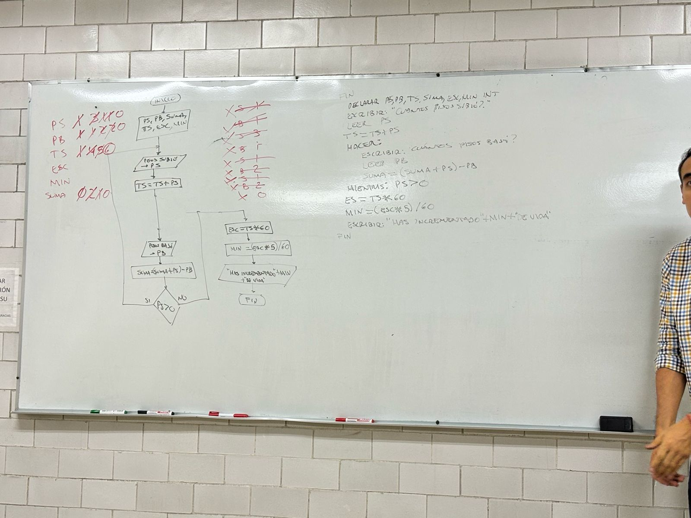

## 8.-TIEMPO DE VIDA
> #### Clase: 19/04/24

En un edificio, cada vez que una persona sube un escalón, incrementa su tiempo de vida en 5 segundos. Se establece que para subir cada piso del edificio se tienen 60 escalones. Con base en esta información, se solicita calcular el tiempo de vida en minutos que una persona incrementa al subir una cantidad determinada de pisos en el edificio.

El proceso de cálculo se inicia considerando que la persona se encuentra en la planta baja o piso 0 del edificio. Se plantea un escenario iterativo donde se pregunta al usuario cuántos pisos sube, seguido de cuántos pisos baja, y así sucesivamente, hasta que se regrese al punto de partida, que es la planta baja o piso 0.

Cuando llegamos a este punto, si el usuario ingresa que no sube ningún piso (es decir, ingresa 0), el programa no solicitará información adicional sobre los pisos bajados y procederá a mostrar directamente cuántos minutos ha incrementado su vida.

Es importante destacar que únicamente se consideran los escalones subidos para calcular el tiempo de vida, es decir, los pisos o escalones bajados no contribuyen al incremento del tiempo de vida

#### Partimos del diagrama de flujo y pseudocódigo

<p align="center">
  
</p>


Corrigiendo un poco el pseucódigo del pizarron para que coincida con el diagrama de flujo presentado.

```C++
INICIO
  DECLARAR PS, PB, TS, SUMA, ESC, MIN, ENTEROS;
  HACER:
    ESCRIBIR "CUANTOS PISOS SUBIÓ?: ";
    LEER PS;
    TS = TS + PS;
    ESCRIBIR "CUANTOS PISOS BAJÓ?: ";
    LEER PB;
    SUMA = (SUMA + PS) - PB;
  MIENTRAS PS > 0;
  ESC = TS * 60;
  MIN = (ESC * 5) / 60;
  ESCRIBIR "HAS INCREMENTADO " + MIN + " DE VIDA ";
FIN  
```

### [Código del ejercicio](src/tiempodevidaporsubirescalones.cpp)

## Contribuciones
Las contribuciones son bienvenidas. Si encuentras errores o formas de mejorar el código, no dudes en querer contribuir.
